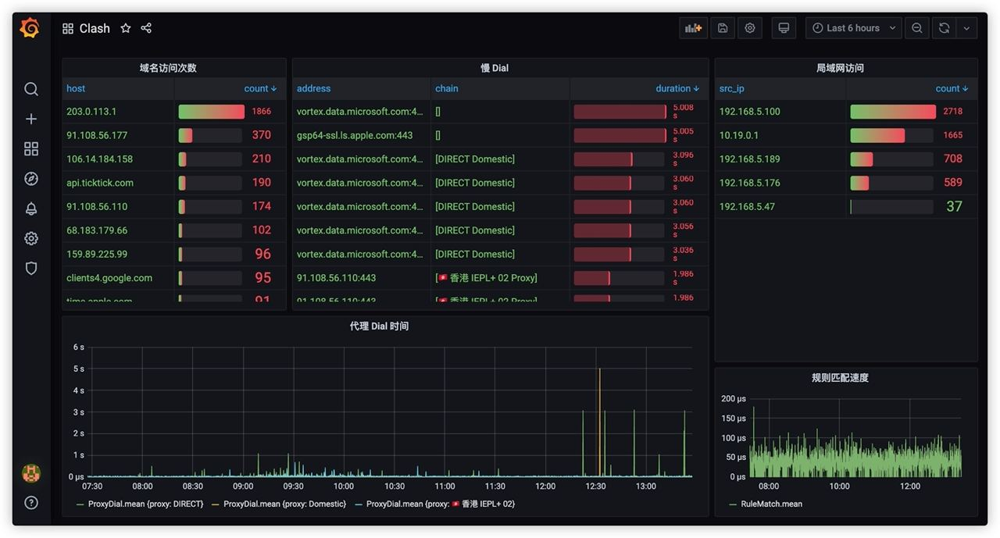

# Clash Tracing Dashboard

An example of a clash tracing exporter API.

### Screenshot

### How to use

1. modify `docker-compose.yaml` and start (`docker-compose up -d`)
2. setup Grafana
3. import `grafana.json` to Grafana
